<div align="center">

# ⚡ AWS Serverless CRUD API Lab

### API Gateway + Lambda + DynamoDB

[](https://aws.amazon.com/)
[](https://aws.amazon.com/lambda/)
[](https://aws.amazon.com/api-gateway/)
[](https://aws.amazon.com/dynamodb/)
[](https://python.org)
[](https://aws.amazon.com/iam/)

<br/>

A hands-on lab to **build, deploy, and test a fully serverless CRUD API** on AWS — from IAM policies to live endpoint testing via Postman and cURL.

</div>

---

## 📑 Table of Contents

- [Architecture](#-architecture)
- [Prerequisites](#-prerequisites)
- [Supported Operations](#-supported-operations)
- [Setup Instructions](#%EF%B8%8F-setup-instructions)
  - [Step 1: Create IAM Policy](#step-1-create-iam-policy)
  - [Step 2: Create Lambda Execution Role](#step-2-create-lambda-execution-role)
  - [Step 3: Create Lambda Function](#step-3-create-lambda-function)
  - [Step 4: Test Lambda Function](#step-4-test-lambda-function)
  - [Step 5: Create DynamoDB Table](#step-5-create-dynamodb-table)
  - [Step 6: Create REST API in API Gateway](#step-6-create-rest-api-in-api-gateway)
  - [Step 7: Deploy the API](#step-7-deploy-the-api)
- [Run & Validate](#-run--validate)
- [Cleanup](#-cleanup)
- [Key Takeaways](#-key-takeaways)

---

## 🏗️ Architecture

```
                    ┌──────────────────────────────────────────────┐
                    │              AWS Cloud                       │
                    │                                              │
  Client            │  ┌──────────────┐    ┌──────────────────┐    │
  (Postman/cURL)────┼─▶│ API Gateway  │───▶│  Lambda Function │    │
                    │  │ (REST API)   │    │  (Python 3.13)   │    │
                    │  │              │    │                  │    │
                    │  │  POST /      │    │  CRUD Handler    │    │
                    │  │  DynamoDB    │    │                  │    │
                    │  │  Manager     │    └───────┬──────────┘    │
                    │  └──────────────┘            │               │
                    │                              ▼               │
                    │                    ┌───────────────────┐     │
                    │                    │    DynamoDB       │     │
                    │                    │  lambda-apigateway│     │
                    │                    │    (Table)        │     │
                    │                    └───────────────────┘     │
                    └──────────────────────────────────────────────┘
```

<details>
<summary>📸 <strong>Architecture Diagram (Screenshot)</strong></summary>
<br/>

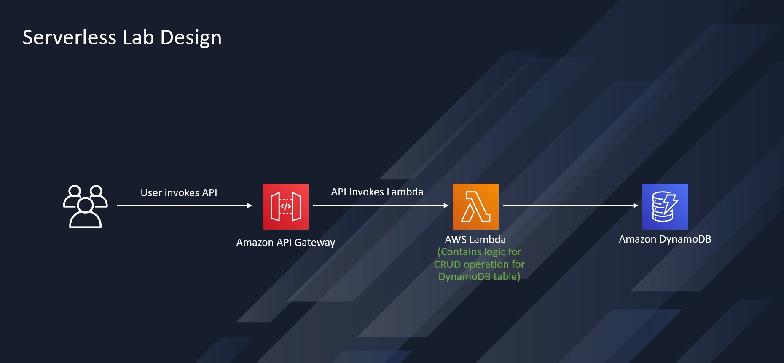

</details>

---

## 📋 Prerequisites

| Requirement | Details |
|:--|:--|
| **AWS Account** | Free tier eligible |
| **IAM Access** | Permission to create roles, policies, Lambda functions, DynamoDB tables, and API Gateway APIs |
| **API Testing Tool** | [Postman](https://www.postman.com/) or cURL |
| **AWS Region** | Any region supporting Lambda, API Gateway, and DynamoDB |

---

## ⚙️ Supported Operations

The Lambda function routes requests based on the `operation` field in your JSON payload:

| Operation | Description | DynamoDB Action |
|:--|:--|:--|
| `create` | Insert a new item | `PutItem` |
| `read` | Get a single item by key | `GetItem` |
| `update` | Modify an existing item | `UpdateItem` |
| `delete` | Remove an item by key | `DeleteItem` |
| `list` | Scan all items in a table | `Scan` |
| `echo` | Return the payload (debug) | — |
| `ping` | Health check | — |

<details>
<summary>📋 <strong>Example Payloads</strong></summary>

**Create Item**
```json
{
  "operation": "create",
  "tableName": "lambda-apigateway",
  "payload": {
    "Item": {
      "id": "1",
      "name": "Bob"
    }
  }
}
```

**Read Item**
```json
{
  "operation": "read",
  "tableName": "lambda-apigateway",
  "payload": {
    "Key": {
      "id": "1"
    }
  }
}
```

**Delete Item**
```json
{
  "operation": "delete",
  "tableName": "lambda-apigateway",
  "payload": {
    "Key": {
      "id": "1"
    }
  }
}
```

**List All Items**
```json
{
  "operation": "list",
  "tableName": "lambda-apigateway",
  "payload": {}
}
```

</details>

---

## 🛠️ Setup Instructions

### Step 1: Create IAM Policy

<details>
<summary>📸 <strong>Expand for step-by-step with screenshots</strong></summary>
<br/>

1. Open the **IAM Console → Policies**
2. Click **Create policy** → select the **JSON** tab
3. Paste the following policy:

```json
{
  "Version": "2012-10-17",
  "Statement": [
    {
      "Action": [
        "dynamodb:DeleteItem",
        "dynamodb:GetItem",
        "dynamodb:PutItem",
        "dynamodb:Query",
        "dynamodb:Scan",
        "dynamodb:UpdateItem"
      ],
      "Effect": "Allow",
      "Resource": "*"
    },
    {
      "Action": [
        "logs:CreateLogGroup",
        "logs:CreateLogStream",
        "logs:PutLogEvents"
      ],
      "Effect": "Allow",
      "Resource": "*"
    }
  ]
}
```

4. Name it `lambda-custom-policy` and click **Create policy**

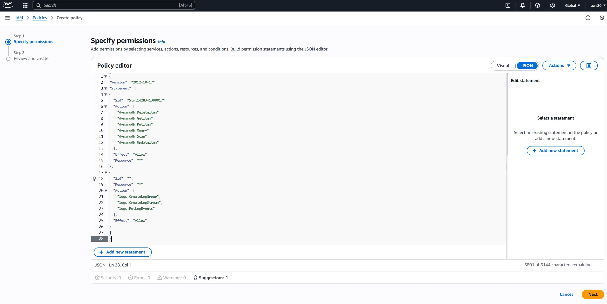

</details>

> **Policy grants:** DynamoDB CRUD operations + CloudWatch Logs for Lambda monitoring.

---

### Step 2: Create Lambda Execution Role

<details>
<summary>📸 <strong>Expand for step-by-step with screenshots</strong></summary>
<br/>

1. Open **IAM Console → Roles** → **Create Role**
2. Trusted entity: **AWS Service** → Use case: **Lambda**
3. Attach policy: `lambda-custom-policy`
4. Role name: `lambda-apigateway-role`

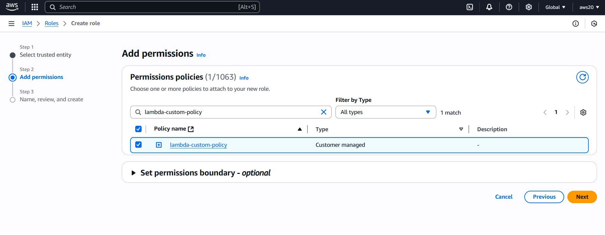

</details>

> **This role** allows the Lambda function to interact with DynamoDB and write logs to CloudWatch.

---

### Step 3: Create Lambda Function

<details>
<summary>📸 <strong>Expand for step-by-step with screenshots</strong></summary>
<br/>

1. Open **Lambda Console → Create Function**
2. Author from scratch:
   - **Name:** `LambdaFunctionOverHttps`
   - **Runtime:** `Python 3.13`
   - **Existing role:** `lambda-apigateway-role`

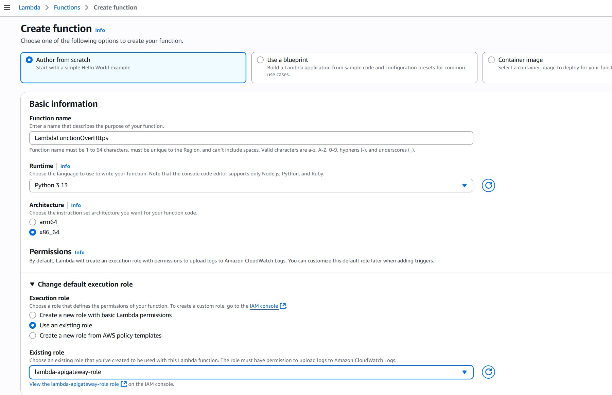

3. Replace the boilerplate code with the handler below

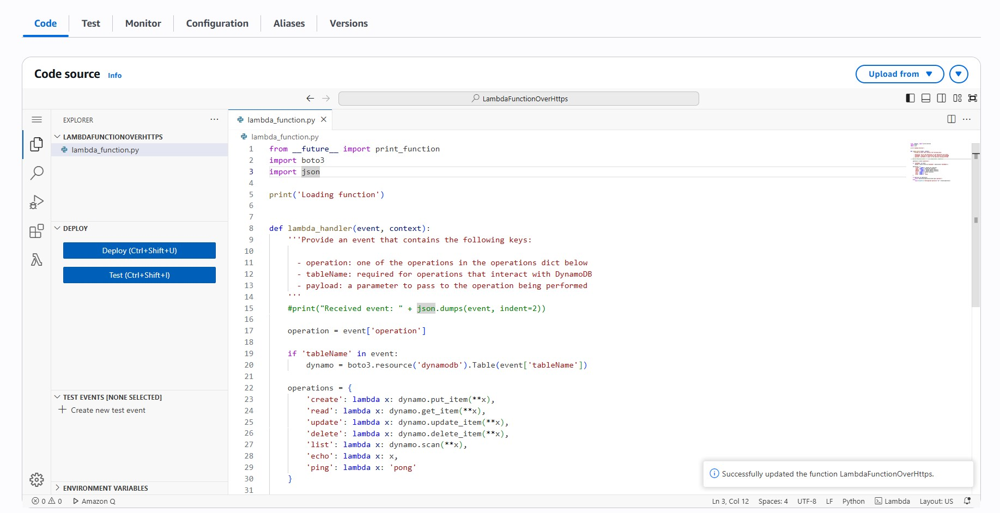

</details>

**Lambda Handler** — [`lambda_function.py`](./lambda_function.py)

```python
from __future__ import print_function
import boto3
import json

print('Loading function')

def lambda_handler(event, context):
    operation = event['operation']

    if 'tableName' in event:
        dynamo = boto3.resource('dynamodb').Table(event['tableName'])

    operations = {
        'create': lambda x: dynamo.put_item(**x),
        'read': lambda x: dynamo.get_item(**x),
        'update': lambda x: dynamo.update_item(**x),
        'delete': lambda x: dynamo.delete_item(**x),
        'list': lambda x: dynamo.scan(**x),
        'echo': lambda x: x,
        'ping': lambda x: 'pong'
    }

    if operation in operations:
        return operations[operation](event.get('payload'))
    else:
        raise ValueError(f'Unrecognized operation "{operation}"')
```

---

### Step 4: Test Lambda Function

<details>
<summary>📸 <strong>Expand for step-by-step with screenshots</strong></summary>
<br/>

Create a test event in the Lambda console with this payload:

```json
{
  "operation": "echo",
  "payload": {
    "somekey1": "somevalue1",
    "somekey2": "somevalue2"
  }
}
```

Expected result: the payload is returned as-is.

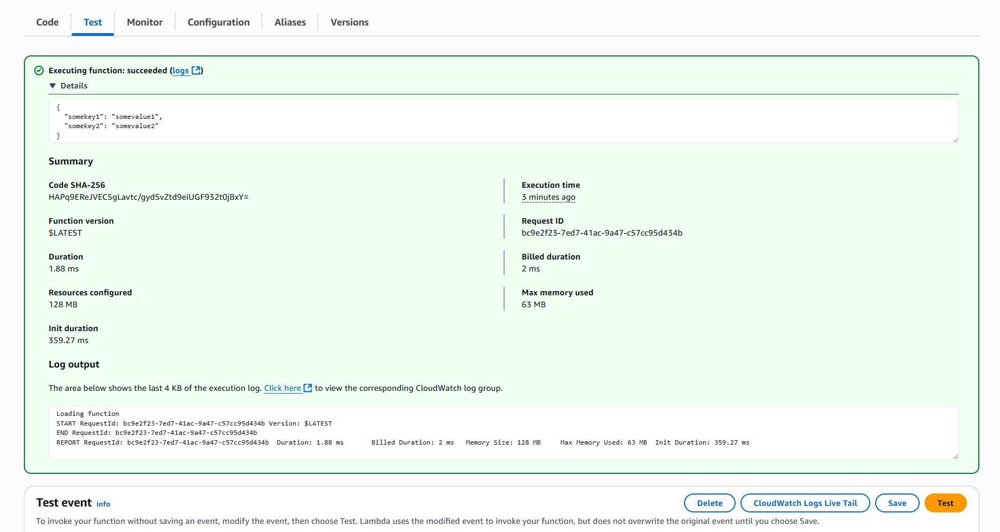

</details>

---

### Step 5: Create DynamoDB Table

<details>
<summary>📸 <strong>Expand for step-by-step with screenshots</strong></summary>
<br/>

| Setting | Value |
|:--|:--|
| **Table name** | `lambda-apigateway` |
| **Partition key** | `id` (String) |
| **Settings** | Default |

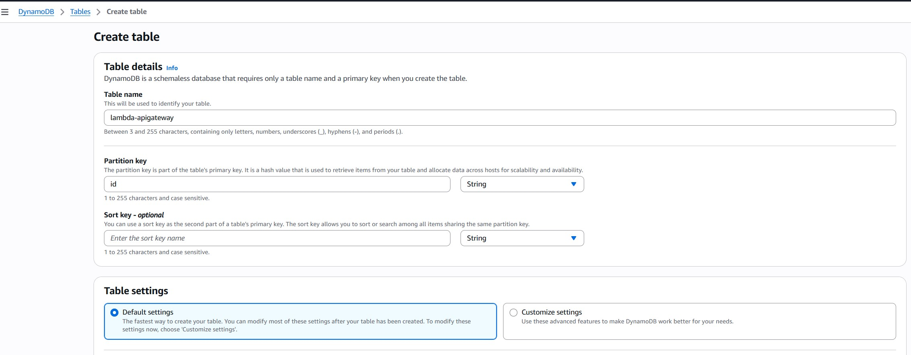

</details>

---

### Step 6: Create REST API in API Gateway

<details>
<summary>📸 <strong>Expand for step-by-step with screenshots</strong></summary>
<br/>

1. Open **API Gateway Console → Create API → REST API → Build**
2. API name: `DynamoDBOperations`
3. Create Resource: `/DynamoDBManager`
4. Add `POST` method → Integration type: **Lambda Function** → select `LambdaFunctionOverHttps`

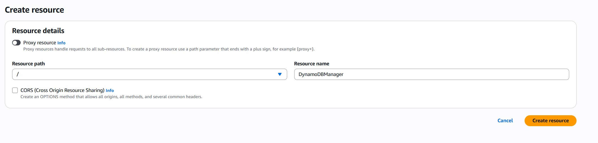
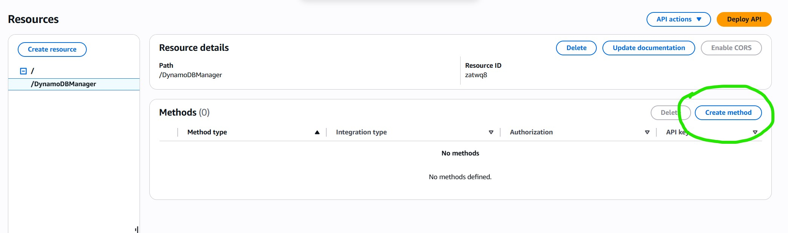
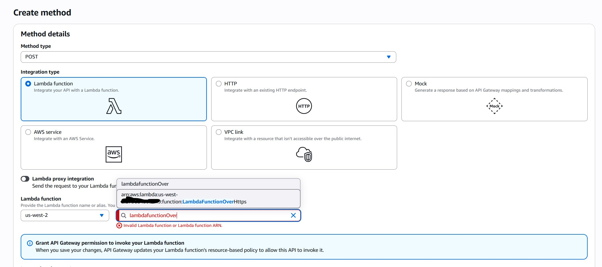

</details>

---

### Step 7: Deploy the API

<details>
<summary>📸 <strong>Expand for step-by-step with screenshots</strong></summary>
<br/>

1. Click **Deploy API**
2. Stage name: `prod`
3. Copy the **Invoke URL** — you'll need it for testing

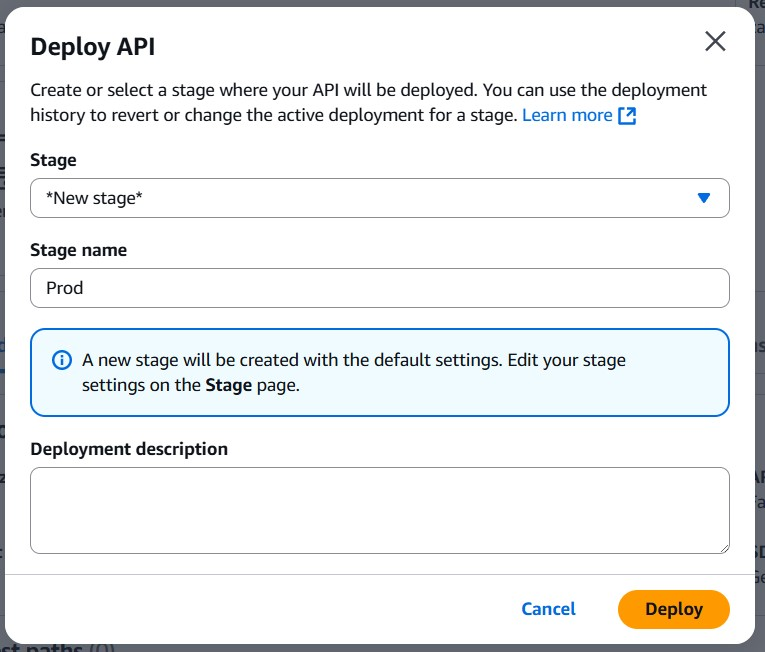
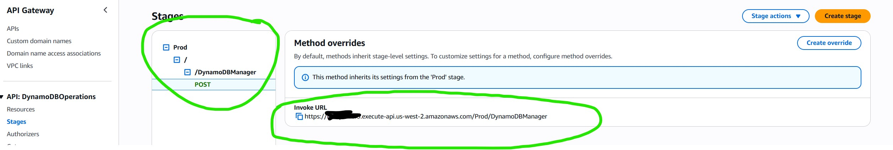

</details>

---

## 🚀 Run & Validate

### Postman

1. Set method: **POST**
2. Paste your Invoke URL + `/DynamoDBManager`
3. Body → raw → JSON:

```json
{
  "operation": "create",
  "tableName": "lambda-apigateway",
  "payload": {
    "Item": {
      "id": "1234ABCD",
      "number": 5
    }
  }
}
```

<details>
<summary>📸 <strong>Screenshot</strong></summary>
<br/>

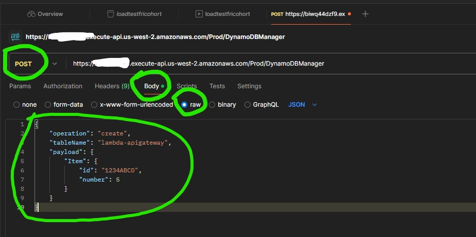

</details>

### cURL

```bash
curl -s -X POST \
  -H "Content-Type: application/json" \
  -d '{
    "operation": "create",
    "tableName": "lambda-apigateway",
    "payload": {
      "Item": {"id": "1", "name": "Bob"}
    }
  }' \
  https://<API_ID>.execute-api.<REGION>.amazonaws.com/prod/DynamoDBManager
```

### Verify in DynamoDB

Navigate to DynamoDB Console → `lambda-apigateway` table → **Explore table items**

<details>
<summary>📸 <strong>Screenshots</strong></summary>
<br/>

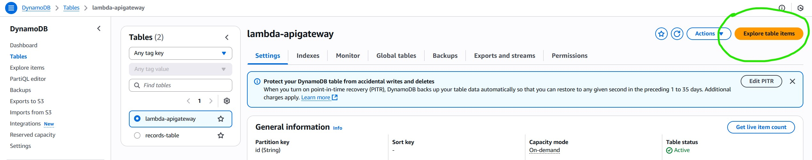
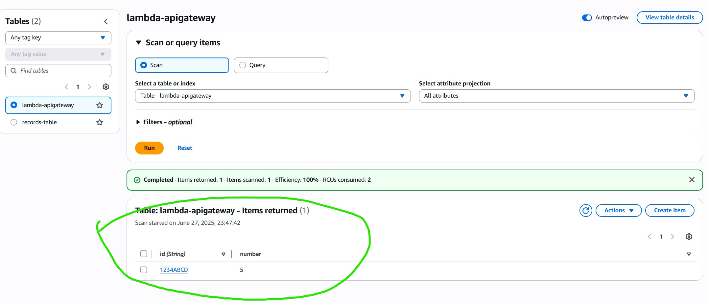

</details>

---

## 🧹 Cleanup

> ⚠️ Delete these resources to avoid ongoing AWS charges:

| Resource | Service | Name |
|:--|:--|:--|
| REST API | API Gateway | `DynamoDBOperations` |
| Function | Lambda | `LambdaFunctionOverHttps` |
| Table | DynamoDB | `lambda-apigateway` |
| Role | IAM | `lambda-apigateway-role` |
| Policy | IAM | `lambda-custom-policy` |

---

## 🎯 Key Takeaways

- Built a **fully serverless** REST API with zero infrastructure management
- Implemented **least-privilege IAM** with a custom policy scoped to DynamoDB + CloudWatch
- Created a **single Lambda handler** supporting 7 operations via JSON payload routing
- Deployed via **API Gateway** with a production stage and invoke URL
- Validated end-to-end with **Postman** and **cURL**

---

<div align="center">

**Built by [Rodiel Lezcano](https://github.com/Rodiel-Lezcano)** · Solutions Architect

[](https://www.linkedin.com/in/rodiellezcano/)
[](https://github.com/Rodiel-Lezcano)

</div>
